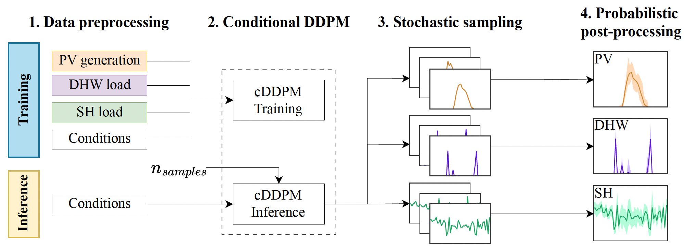

# LF-Prob-Disaggregation
Probabilistic DER disaggregation from low-frequency smart meter data using conditional diffusion models.

# LF-Prob-Disaggregation
**Probabilistic DER disaggregation from low-frequency smart meter data using diffusion models**



This repository contains the codebase associated with the paper:

> *Conditional Diffusion Model for Probabilistic Disaggregation of PV Systems and Heat Pumps*  
> Marc Jené-Vinuesa, Hussain Kazmi, Mònica Aragüés-Peñalba, Andreas Sumper  
> PSCC 2026 – Power Systems Computation Conference

The project introduces a **conditional denoising diffusion probabilistic model (cDDPM)** for **probabilistic disaggregation of behind-the-meter distributed energy resources (DERs)** from **low-frequency (LF) smart meter data**.

The methodology jointly reconstructs:

- **PV generation**
- **Heat pump consumption for domestic hot water (DHW)**
- **Heat pump consumption for space heating (SH)**

using **net consumption and weather variables as conditioning signals**.  
By leveraging generative diffusion models, the approach produces both **accurate point estimates** and **well-calibrated uncertainty quantification**, enabling improved **grid-edge visibility and flexibility assessment**.

---

# ⚠️ Repository Status

This repository is **currently under construction**.

We are cleaning and modularizing the codebase and preparing documentation and examples.

- ✅ Core diffusion model implementation is being organized.
- 🚧 Example notebooks and experiment scripts are **not yet included**.
- 🚧 The Dutch dataset used in the paper **cannot be shared due to privacy constraints**.

Additional materials will be progressively released to facilitate reproducibility.

---

# 📂 Repository Structure (planned)

```text
├── src/                # Core library
│   ├── models/         # Diffusion models and U-Net architecture
│   ├── diffusion/      # Noise schedule and sampling utilities
│   ├── preprocessing/  # Data preprocessing and normalization
│   └── evaluation/     # Deterministic and probabilistic metrics
│
├── notebooks/          # Example experiments and visualizations
├── experiments/        # Training scripts and configurations
├── figures/            # Figures reproduced from the paper
├── data/               # Instructions or scripts to access data
└── README.md
```

🚀 Getting Started

The repository will soon contain example notebooks and scripts demonstrating:

training the diffusion model

generating probabilistic disaggregated profiles

computing deterministic and probabilistic evaluation metrics

For now, the repository provides the core implementation of the diffusion-based disaggregation model.

⚙️ Installation (Python 3.11)

Install the appropriate PyTorch version first (CPU or CUDA), then the project dependencies.

# Option A — CPU-only
pip install torch==2.6.0

# Option B — CUDA (example: CUDA 12.4)
pip install --index-url https://download.pytorch.org/whl/cu124 torch==2.6.0

# Install project dependencies
pip install -r requirements.txt
📊 Methodology Overview

The proposed framework performs probabilistic DER disaggregation through four main steps:

Data preprocessing
Daily smart-meter and submetered profiles are normalized and transformed into tensors.

Conditional diffusion model
A multivariate 1D U-Net diffusion model learns the joint distribution of DER profiles conditioned on:

net consumption

irradiance

temperature

Stochastic sampling
Multiple samples are generated through the reverse diffusion process.

Probabilistic post-processing
Prediction intervals and point estimates are obtained from empirical quantiles.

📄 Citation

If you use this code in your research, please cite:

@inproceedings{jene2026diffusion,
  title={Conditional Diffusion Model for Probabilistic Disaggregation of PV Systems and Heat Pumps},
  author={Jené-Vinuesa, Marc and Kazmi, Hussain and Aragüés-Peñalba, Mònica and Sumper, Andreas},
  booktitle={Power Systems Computation Conference (PSCC)},
  year={2026}
}
📄 License

The repository will be released under an open-source license once the final version of the paper is published.

📢 Contact

For questions or collaborations:

Marc Jené-Vinuesa
CITCEA-UPC – Universitat Politècnica de Catalunya
📧 marc.jene@upc.edu
